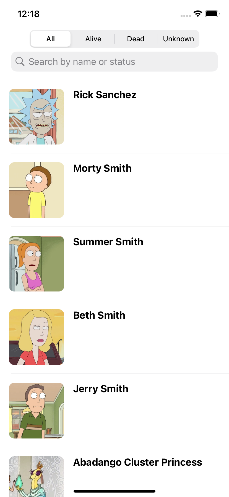
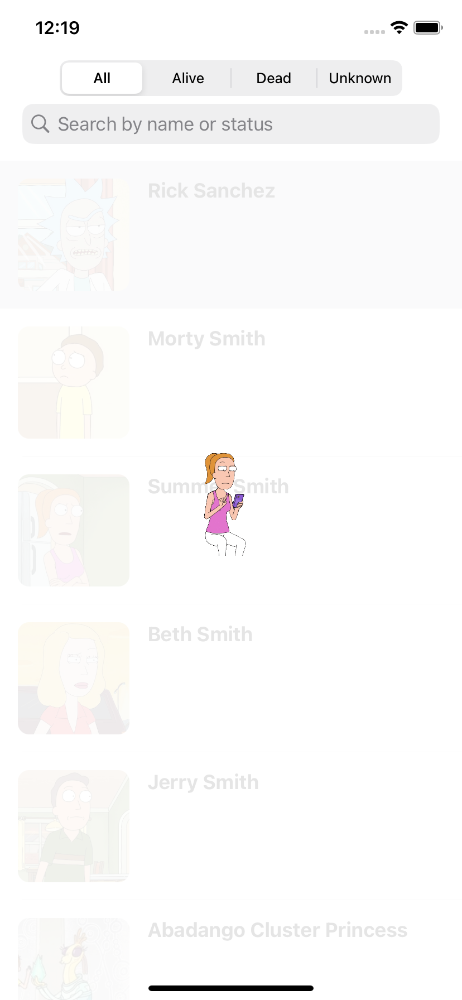

# RickAndMortyExplorer

# 🛸 RickAndMortyExplorer

iOS-приложение на **Swift** с архитектурой **MVVM**, которое позволяет исследовать мир *Rick and Morty* с помощью открытого API.  

---

##  Возможности
-  Список персонажей с пагинацией  
-  Поиск и фильтрация по имени или статусу  
-  Экран деталей персонажа (фото, статус, эпизоды, локация)  
-  Реализованный на UIKit (без Storyboard)  
-  Чистая архитектура **MVVM**   

---

##  Технологии
- **Swift, UIKit**  
- **MVVM**  
- **URLSession / API-клиент**  
- **SnapKit**  

---

##  Скриншоты 

| Список персонажей | Детали персонажа | Экран загрузки | Поиск |
|------------------|------------------|------------------|------------------|
|  |  |  | 

---

##  Техническое задание
В репозитории есть файл `тз.pdf` с описанием требований. Кратко:  
- Экран списка персонажей с пагинацией  
- Поиск и фильтрация по имени / статусу  
- Экран деталей: картинка, статус, эпизоды, локация  
- Архитектура MVVM  

